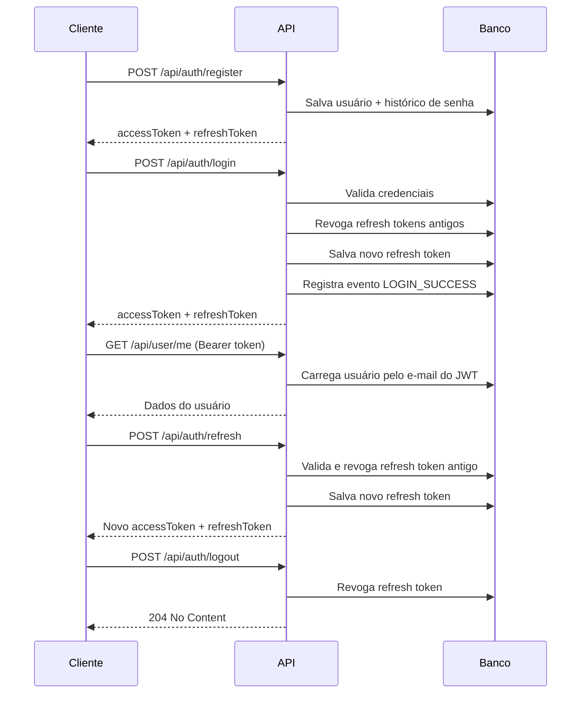
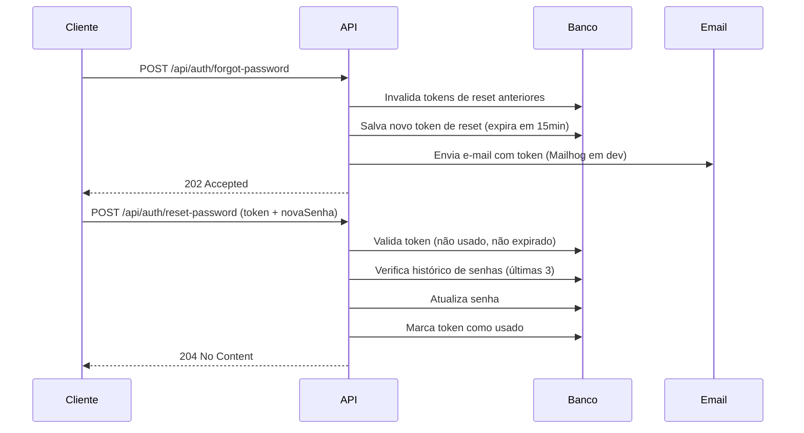
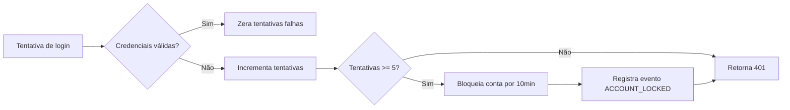

<div align="center">

# Janus

**API Standalone de Autenticação e Autorização**


</div>

---

## Visão Geral

Janus é uma API de autenticação e autorização pronta para produção, construída com Spring Boot 4 e Spring Security 6. Gerencia registro de usuários, autenticação via JWT, rotação de refresh token, controle de acesso por roles, bloqueio de conta, recuperação de senha e auditoria de eventos de segurança.

O nome vem de Janus, o deus romano das portas e passagens — quem decide quem pode passar.

---

## Funcionalidades

- Autenticação JWT com access token (15min) e refresh token (7 dias)
- Rotação de refresh token — cada uso gera um novo token e invalida o anterior
- Controle de acesso por roles — `USER`, `MODERATOR`, `ADMIN`
- Bloqueio de conta após 5 tentativas de login falhas (bloqueio de 10 minutos)
- Recuperação de senha por e-mail com token de uso único e expiração
- Histórico de senhas — impede reutilização das últimas 3 senhas
- Audit log de segurança — registra login, falhas, bloqueio e reset de senha
- Respostas de erro padronizadas em todos os endpoints
- Migrations com Flyway
- Testes de integração com Testcontainers

---

## Stack

| Camada | Tecnologia |
|---|---|
| Linguagem | Java 21 |
| Framework | Spring Boot 4.0.3 |
| Segurança | Spring Security 6 |
| Banco de Dados | PostgreSQL 16 |
| Migrations | Flyway 10 |
| JWT | JJWT 0.12.6 |
| E-mail | Spring Mail + Mailhog (dev) |
| Testes | JUnit 5 + Mockito + Testcontainers |
| Container | Docker + Docker Compose |

---

## Como Rodar

### Pré-requisitos

- Java 21+
- Docker

### Rodando localmente

```bash
# 1. Clone o repositório
git clone https://github.com/vitorsaucedo/janus.git
cd janus

# 2. Suba a infraestrutura
docker compose up postgres mailhog

# 3. Rode a aplicação
./mvnw spring-boot:run
```

A API estará disponível em `http://localhost:8080`.  
O Mailhog (interface de e-mail) em `http://localhost:8025`.

### Variáveis de ambiente

| Variável | Descrição | Padrão |
|---|---|---|
| `JANUS_JWT_SECRET` | Chave de assinatura JWT (mín. 32 caracteres) | secret de dev |
| `SPRING_DATASOURCE_URL` | URL do banco | localhost:5432/authdb |
| `SPRING_DATASOURCE_USERNAME` | Usuário do banco | auth |
| `SPRING_DATASOURCE_PASSWORD` | Senha do banco | auth123 |

> Em produção, sempre defina `JANUS_JWT_SECRET` via variável de ambiente. Nunca versione secrets no repositório.

---

## Endpoints

### Autenticação

| Método | Endpoint | Auth | Descrição |
|---|---|---|---|
| POST | `/api/auth/register` | Público | Registra um novo usuário |
| POST | `/api/auth/login` | Público | Autentica e retorna os tokens |
| POST | `/api/auth/refresh` | Público | Rotaciona o refresh token |
| POST | `/api/auth/logout` | Público | Revoga o refresh token |
| POST | `/api/auth/forgot-password` | Público | Solicita e-mail de recuperação de senha |
| POST | `/api/auth/reset-password` | Público | Redefine a senha com o token recebido |

### Usuário

| Método | Endpoint | Auth | Descrição |
|---|---|---|---|
| GET | `/api/user/me` | Bearer Token | Retorna os dados do usuário autenticado |

### Health

| Método | Endpoint | Auth | Descrição |
|---|---|---|---|
| GET | `/actuator/health` | Público | Status da aplicação |

---

## Fluxo de Autenticação



---

## Fluxo de Recuperação de Senha



---

## Bloqueio de Conta

Após **5 tentativas consecutivas de login com falha**, a conta é bloqueada por **10 minutos**.



O desbloqueio acontece automaticamente após o tempo de bloqueio — sem intervenção manual.

---

## Formato de Erro

Todos os erros seguem um formato consistente:

```json
{
  "status": 401,
  "error": "Unauthorized",
  "message": "Invalid email or password",
  "timestamp": "2026-02-21T15:30:00"
}
```

---

## Schema do Banco

```
users
├── id, email, password, name, role
├── enabled, account_non_locked
├── failed_login_attempts, locked_until
└── created_at, updated_at

refresh_tokens
├── id, token, user_id
├── expires_at, revoked
└── created_at

password_reset_tokens
├── id, token, user_id
├── expires_at, used
└── created_at

password_history
├── id, user_id
├── password_hash
└── created_at

security_events
├── id, email, type, ip_address
└── created_at
```

---

## Testes

```bash
# Todos os testes (requer Docker para o Testcontainers)
./mvnw test

# Somente unitários
./mvnw test -Dtest="JwtServiceTest,AuthServiceTest"

# Somente integração
./mvnw test -Dtest="AuthIntegrationTest"

# Com relatório de cobertura (target/site/jacoco/index.html)
./mvnw test jacoco:report
```

---

## Estrutura do Projeto

```
src/main/java/com/vitorsaucedo/janus/
├── api/
│   ├── auth/               # Endpoints de autenticação + DTOs
│   └── user/               # Endpoints de usuário + DTOs
├── audit/                  # Registro de eventos de segurança
├── domain/
│   ├── email/              # Serviço de e-mail
│   ├── token/              # Lógica de refresh e reset token
│   └── user/               # Entidade User + histórico de senhas
├── exception/              # Handler global de exceções
└── security/               # Filtro JWT + configuração do Security
```

---

## Decisões Técnicas

**Por que uma API de auth separada?**  
Separar autenticação da lógica de negócio permite que qualquer serviço consuma esta API, seguindo o princípio de responsabilidade única e possibilitando escalonamento independente.

**Por que UUID para refresh token em vez de JWT?**  
Refresh tokens armazenados no banco permitem revogação imediata. Refresh tokens JWT não podem ser invalidados antes da expiração sem uma blacklist — o que adiciona complexidade sem benefício real.

**Por que PostgreSQL para armazenar tokens em vez de Redis?**  
Para um projeto de portfólio, o PostgreSQL simplifica a infraestrutura sem diferença de performance perceptível. Em produção com alto tráfego, Redis seria a escolha certa para lookups O(1) com expiração automática via TTL.

**Por que Flyway com `ddl-auto=validate`?**  
O Flyway fornece um histórico versionado e auditável das mudanças no schema. O `validate` garante que o modelo de entidades sempre corresponda ao banco real, falhando rápido em caso de divergência em vez de alterar tabelas silenciosamente.

---

<div align="center">

Desenvolvido por [Vitor Saucedo](https://github.com/vitorsaucedo)

</div>